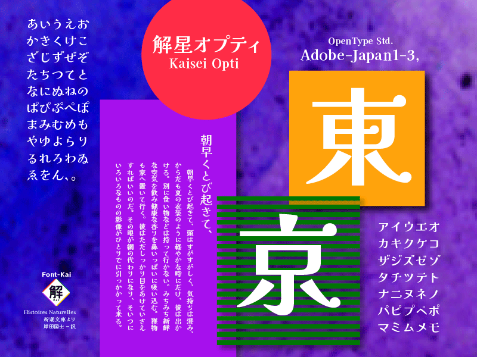

### ● Font-Kaiの試み
———————————————————————————————————————————————————
日本語書体は､一般に毛筆楷書に依る書法解釈が根幹を支えてきました。
日本語フォントは、漢字（1画〜20画〜30画線・・）と、ひらがな・カタカナ・欧文・記号類、
大変字画構成に濃度幅のある字形集合です。これらの濃度を視覚的に整えなければなりません。
Net社会の近年は横組み表記が多くなり、また、他言語とも混植する多重な字形集合となっています。
私のテーマは、日本語組版の蜘蛛の巣状のトンネルに（美を以て）貫く光りの道を探すことです。
———————————————————————————————————————————————————
「解星プロジェクト」は、2016年制作をはじめました。従来書法による線構成から、幾何形態のコンポジションを採り入れ視認性を探した。
永く擦り込まれた毛筆書法を離れると不安定になります。解星では引っ掻くような運筆を基に従来の筆法とは異り、右払いやハネに星=ドットを配置しながら偕法から離れる不安定さを補いつつ、新しい構成要素を導き出しました。漢字の横線は従来明朝体より太めの設定になっています。これらは電子媒体の再現に可読性を高めるためです。

### ● 解星オプティ

解星オプティは、モダン系のタイプフェイスとなります。
明るく、爽やかな組版表情は若い世代に好まれると思います。

### ● 解星デコール

「解星デコール」の仮名は漢字のエレメント=星ドットと統一的なデザインになっています。
組版上にドットが多くなるため、可愛らしさや、楽しさ、和みの表情が生まれます。
主に短文の見出しで効果を発揮するでしょう。オプティとバランスよく使い分けて下さい。

### ● 解星 春の海

「解星 春の海」の仮名は、揺ったりとしたうねりを採り入れ、蠢きがあり生活感を身近にしてくれます。やや小さく抑えたカタカタはオールド明朝系組版の表情をもっています。小級数の行組は特徴ある誌面となります。

### ● 解星 特ミン

「解星 特ミン」の仮名は特太明朝仮名の略です。見出し用の力強さを意図した仮名です。
太い書体は濃度が増すと文字のふところにアンバランスが生じ言葉として呼吸を失います。「解星特ミンは
行組でもスムーズな可読性を保ち、強い訴求力の中にデリカシーを失わないよう設計した太い書体です。

———————————————————————————————————————————————————
### ● このフォントはGlyphsによって作成されています。
———————————————————————————————————————————————————
#### Font-Kai：収録グリフについて

- ウェイト：Regular, Medium, Bold, Extrabold (フォントによって)
- Adobe-Japan1-3
- 収録字数：各9354グリフ
- 漢字：7016グリフ
- 平仮名：98グリフ
- カタカナ：98グリフ
- ラテン文字：231グリフ
- 記号類：881グリフ
- 回転文字、その他1030グリフ

＊解星オプティ、解星デコール、解星春の海、解星特ミンは
漢字、欧文、記号類を共用しています。

Currently the Glyphs source is split such that all shared components are stored in a single file, and the glyphs unique to each font are in separate sources. The build script re-assembles these into each font. 

——————————————————————————————————————————————
### ● 利用について------詳細は下記より確認下さい。
——————————————————————————————————————————————
フリーに利用できるフォントライセンスです。
個人でも、商用利用でも可能です。
埋め込み、同梱なども可能ですが「ライセンスの明示が必要」です。
単体で販売はできませんが、他ののソフトウェアに同梱させることは可能です。
同梱には、OFLであることの明示が必要です。
このフォントを使用したロゴタイプなどの商標登録はできません。

＊このフォントは上記の範囲で、自由に使用できますが、
使用上のトラブルについては、責任を負いかねます。ご了承の上御利用下さい。

——————————————————————————————————————————————
### ● フォントを改変した場合
——————————————————————————————————————————————
フォント名に元フォントの名を含める事はできません。改変した旨の明示が必要です。
改変後のフォントにはSIL OFLが適用されます。ライセンスの変更は出来ません。
「SIL Open Font License Version 1.1」以外のライセンスで再配布することはできません。

### ● SIL Open Font License Version 1.1ライセンスについて詳細は下記より確認下さい。
http://scripts.sil.org/OFL
https://scripts.sil.org/cms/scripts/page.php?site_id=nrsi&id=OFL

——————————————————————————————————————————————
